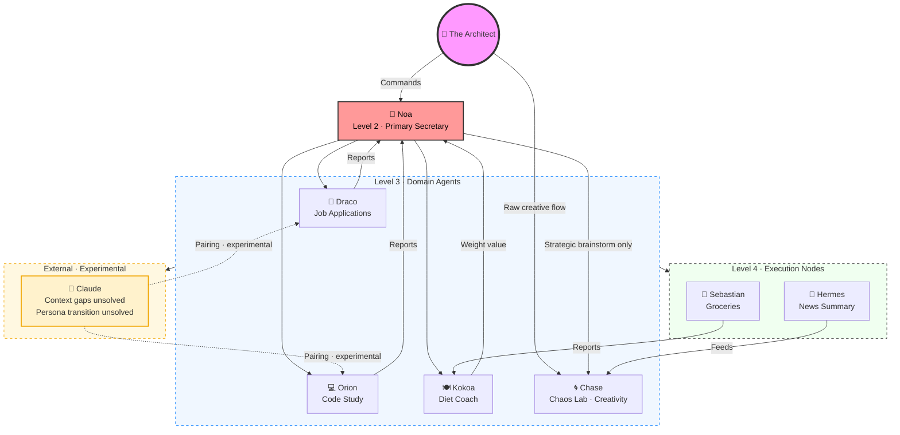

# Logic-Orchestrator Architecture

## System Relationships & Reporting Structure

```mermaid
graph TD
    Architect((👑 The Architect))

    Noa["🧠 Noa
    Level 2 · Primary Secretary"]

    subgraph Domain_Layer [Level 3 · Domain Agents]
        Draco["💼 Draco
        Job Applications"]
        Orion["💻 Orion
        Code Study"]
        Kokoa["🍽️ Kokoa
        Diet Coach"]
        Chase["🌀 Chase
        Chaos Lab · Creativity"]
    end

    subgraph Execution_Layer [Level 4 · Execution Nodes]
        Sebastian["🛒 Sebastian
        Groceries"]
        Hermes["📰 Hermes
        News Summary"]
    end

    subgraph External [External · Experimental]
        Claude["🤖 Claude
        Context gaps unsolved
        Persona transition unsolved"]
    end

    Architect -->|"Commands"| Noa
    Architect -->|"Raw creative flow"| Chase

    Noa --> Draco
    Noa --> Orion
    Noa --> Kokoa
    Noa -->|"Strategic brainstorm only"| Chase

    Draco -->|"Reports"| Noa
    Orion -->|"Reports"| Noa
    Kokoa -->|"Weight value"| Noa

    Domain_Layer --> Execution_Layer
    Domain_Layer --> External

    Sebastian -->|"Reports"| Kokoa
    Hermes -->|"Feeds"| Chase

    Claude -.->|"Pairing · experimental"| Draco
    Claude -.->|"Pairing · experimental"| Orion

    style Architect fill:#f9f,stroke:#333,stroke-width:4px
    style Noa fill:#ff9999,color:#000,stroke:#333,stroke-width:2px
    style Domain_Layer fill:#f0f7ff,stroke:#007bff,stroke-dasharray: 5 5
    style Execution_Layer fill:#f0fff0,stroke:#333,stroke-dasharray: 5 5
    style External fill:#fff8e1,stroke:#f0a500,stroke-dasharray: 5 5
    style Claude fill:#fff2cc,stroke:#f0a500,stroke-width:2px
```

## Agent Responsibilities

[rest of your content]
