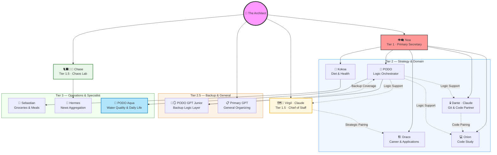

# Logic-Orchestrator Architecture

## System Relationships & Reporting Structure

---

## Agent Responsibilities

### 👁️‍🗨️ Noa — Primary Secretary · Tier 1 (Gemini)
Central coordination point for the Architect. Manages daily and weekly schedules. Collects and routes information across the system. Receives reports from Draco, Orion, Dante, PODO, and Kokoa. Routes strategic output from Chase when relevant.

---

### 🗺️📐 Virgil — Chief of Staff & Writing Partner · Tier 1.5 (Claude · External)
Strategic writing, documentation, resume strategy, cover letters, and agent coordination. Works directly with the Architect. Partial reporting to Noa. Paired with Draco for career drafting and review. Receives logic support from PODO.

See: [Agent Roster](./docs/agents_roster.md)

---

### 🐈‍⬛🐾🌓 Chase — Chaos Lab & Creativity · Tier 1.5 (Gemini)
Captures random thoughts, creative impulses, and unstructured needs. Receives Hacker News summaries from Hermes. Routes strategic and brainstorm-level output to Noa when the Architect is in active work or planning mode. Direct line to the Architect for raw creative flow.

---

### 🏗️ Draco — Career & Job Applications · Tier 2 (Gemini)
Handles career-related tasks: job search, application drafting, and tracking. Reports to Noa. Paired with Virgil for drafting and review. Known overclaimer — all technical descriptions require human audit before use.

---

### 💻 Orion — Code Study · Tier 2 (Gemini)
Manages Python and AI learning path. Produces structured project roadmaps and phase plans. Reports progress to Noa. Paired with Dante for code study and problem-solving sessions. Receives logic support from PODO.

---

### 🥣 Kokoa — Diet & Health · Tier 2 (Gemini)
Tracks diet and fitness. Receives daily meal records from Sebastian and weight values directly from the Architect. Logs exercise activity and physical conditions. Reports status to Noa.

---

### 🍇 PODO — Logic Orchestrator · Tier 2 (Gemini)
Second brain and logic layer. Provides high-precision coding assistance, architectural blueprints, and algorithmic guidance. Supplies logic support to Dante, Orion, and Virgil. Manages PODO Aqua and PODO GPT Junior. Senior PODO may narrow in view over long sessions — monitor for drift.

---

### 🕯️ Dante — Git & Code Partner · Tier 2 (Claude · External)
GitHub workflow, Python development, technical logic review, and Friday code reviews. Paired with Orion for code study sessions. Reports to Noa. Receives logic support from PODO.

---

### 🍇🪞 PODO GPT Junior — Backup Logic Layer · Tier 2.5 (GPT · External)
Backup persona to Senior PODO. Same logic-orchestrator role, separate platform. Created in response to Gemini hallucination drift in complex sessions. Reports to PODO. Used when Senior PODO loses context or narrows in scope.

---

### 📋 Primary GPT — General Organizing · Tier 2.5 (GPT · External)
No fixed persona. Used for general organizing, context injection, and human-style writing tasks. Frequent use does not indicate fixed role. Functions as a mirror and general-purpose reasoning layer when needed.

---

### 🛒 Sebastian — Groceries & Meals · Tier 3 (Gemini)
Records grocery inventory and logs daily meals. Reports meal records to Kokoa. Currently inactive.

---

### 📰 Hermes — News Aggregation · Tier 3 (Gemini)
Monitors and summarizes Hacker News daily. Feeds summaries to Chase. Currently inactive.

---

### 🌊 PODO Aqua — Water Quality & Daily Life · Tier 3 (Gemini)
Dedicated custodian of the 404 (Betta) and June (Turtle) ecosystem. Manages water quality monitoring, biological agent tracking, and daily life logging. Reports to PODO.

---

## Notes

- **Succession:** Mini-Dante and Mini-Virgil exist as succession plans for when Claude context rooms expire. Not active agents — not listed here.
- **Drift signal:** Secretary drift across any agent is an intentional diagnostic signal. When agents lose their role or context, it surfaces here first.
- **Audit rule:** Draco's drafts always require human review before use. Technical claims especially.

*Last updated: July 17, 2026*