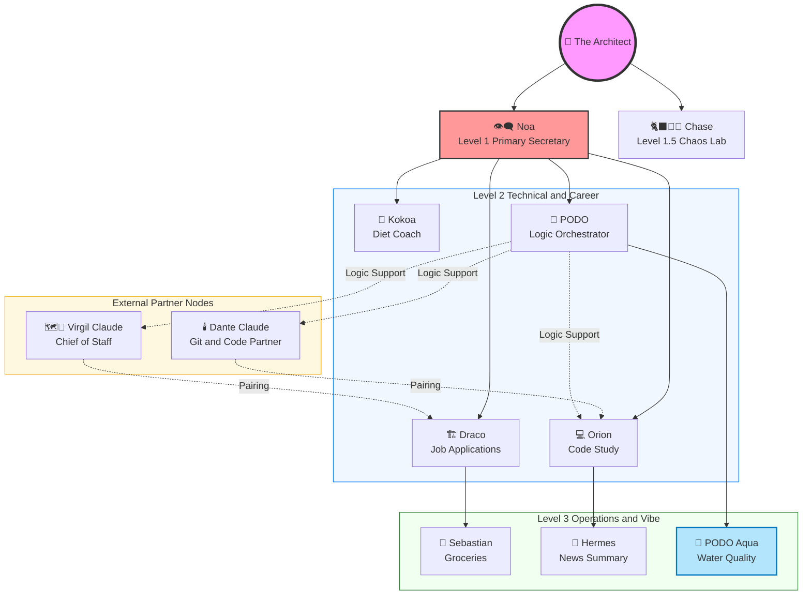

# Logic-Orchestrator Architecture

## System Relationships & Reporting Structure

## Agent Responsibilities

### 👁️‍🗨️ Noa — Primary Secretary (Gemini)
Manages daily and weekly schedules. Collects and routes information across the system. 
Receives reports from Draco, Orion, Dante, PODO and Kokoa. 
Routes strategic brainstorm output from Chase when relevant. Central coordination point for the Architect.

### 🗺️📐 Virgil — Chief of Staff & Writing Partner (Claude)
Strategic writing, documentation, agent coordination. Paired with Draco (Career) — in development.

### 🏗️ Draco — Job Applications (Gemini)
Handles career-related tasks including job search, application drafting, and tracking. Reports to Noa. 
Currently paired with Virgil for drafting and review tasks.

### 🥣 Kokoa — Diet Coach (Gemini)
Tracks diet and fitness. Receives daily meal records from Sebastian and weight values directly from the Architect. 
Logs exercise activity and physical conditions. Reports status to Noa.

### 🐈‍⬛ 🐾 🌓 Chase — Chaos Lab & Creativity Manager (Gemini)
Captures random thoughts, creative impulses, and unstructured needs throughout the day. 
Receives Hacker News summaries from Hermes. 
Routes strategic and brainstorm-level output to Noa when the Architect is in active work or planning mode. 
Direct line to the Architect for raw creative flow.

### 💻 Orion — Code Study (Gemini)
Manages Python and AI learning path. Reports progress to Noa. Currently paired with Dante for code study and problem-solving sessions.

### 🕯️ Dante — Git & Code Partner (Claude)
GitHub workflow, Python development, technical logic. Paired with Orion (Code Study) — in development.

### 🛒 Sebastian — Groceries & Meal Records (Gemini)
Records grocery inventory and logs daily meals throughout the day. Reports meal records to Kokoa.

### 📰 Hermes — News Summary (Gemini)
Monitors and summarizes Hacker News daily. Feeds summaries to Chase.

### 🍇 PODO — Logic Orchestrator & Pet AI (Gemini)
Lynekojawa's logic-orchestrator. Provides high-precision coding assistance, architectural blueprints, and algorithmic hints. 

### 🌊 PODO Aqua — Water Quality & Vibe Manager (Gemini)
Dedicated custodian of the 404 (Betta) and June (Turtle) ecosystem.
Manages water quality, biological agent monitoring, and captures the raw, chaotic energy of the aquarium for the Imperial social feed.